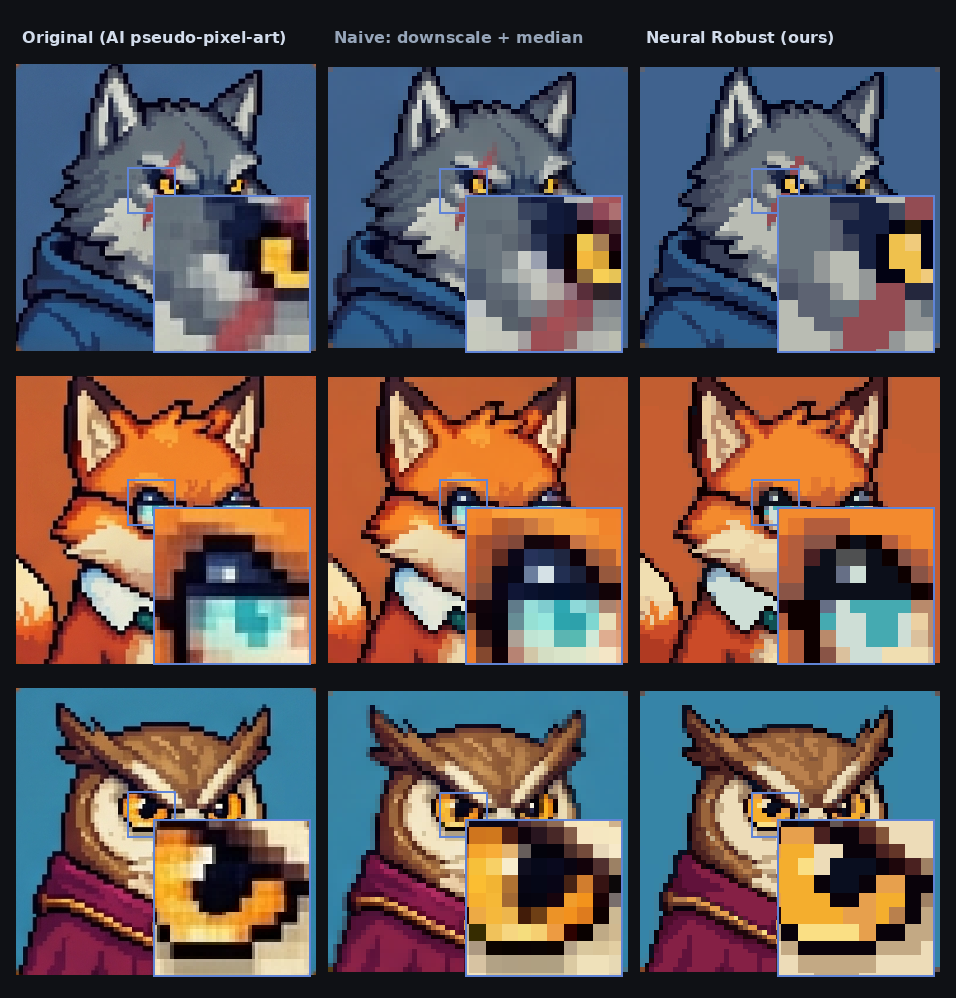

# ai2pixelart

Turn AI-generated *pseudo* pixel art (wobbly grids, mixed-color cells, way
too many shades) into pixel-perfect, palette-clean pixel art — without
losing the single-pixel details that carry the design.



*Left: AI-generated pseudo-pixel-art. Middle: a naive "downscale + median"
baseline — muddy and off-grid. Right: ai2pixelart's Neural Robust output.
Each cell zooms the boxed detail so the difference is visible.*

## Setup

```bash
pip install ai2pixelart              # classical cleaner only (no GPU, no torch)
pip install "ai2pixelart[neural]"    # + run the trained networks
pip install "ai2pixelart[gen]"       # + full data-engine / training stack
```

Or with conda for development:

```bash
conda env create -f environment.yml   # creates env "ai2pixelart"
conda activate ai2pixelart
pip install -e ".[dev]"
```

The classical "Simple" approach needs no GPU; the neural approaches need
the `neural` extra and download their weights from the Hugging Face Hub
([arnekummerow/ai2pixelart](https://huggingface.co/arnekummerow/ai2pixelart))
automatically on first use (cached thereafter — `ai2pixelart models
download` pre-fetches them for offline use).

## Usage

```bash
ai2pixelart clean input.png -o out.png --preview-scale 8         # classical
ai2pixelart clean input.png -o out.png --approach robust         # neural
ai2pixelart clean input.png -o out.png --palette "#1e2234,#5ea740,#f0f0f0"
ai2pixelart clean input.png -o out.png --palette pal.gpl --palette-out used.hex
ai2pixelart clean my_images/ -o out_dir/ --approach robust       # batch a folder
ai2pixelart palette extract input.png -o pal.gpl --colors 16     # palette files
ai2pixelart palette convert pal.gpl -o pal.png --scale 32
ai2pixelart inspect my_images/            # no-ground-truth quality table
ai2pixelart viewer my_images/             # interactive web workspace, port 8412
```

Palettes move in and out as files, in the CLI and the viewer alike: GIMP
`.gpl`, JASC `.pal`, Photoshop `.ase`, paint.net `.txt`, plain `.hex`
lists and PNG swatch strips (`--scale` sets the swatch size). `--palette`
also accepts any image, whose colors then become the forced palette.

Neural inference uses the GPU automatically when one is available and falls
back to CPU otherwise; force it either way with `--device cpu` / `--device
cuda` (the tiny net is CPU-bound in practice, so the GPU mainly helps on
large images or batches).

`--approach` is `simple` (classical, the default) or a neural model — a name
under `runs/` (`robust`, `detail`) or a path to a `.safetensors`/`.ckpt`
file. Run
`ai2pixelart --help` to see the full command tree (`clean`, `viewer`,
`inspect`, `palette`, `eval`, `demo`, plus `data …` and `train …` for the
pipeline).

## How it works

The classical pipeline ("Simple") detects the fake-pixel grid, extracts a
palette, and votes each cell's color — deterministic, no GPU. The neural
presets run the same grid/palette proposal, then a small U-Net assigns
each cell a palette entry; it is structurally incapable of off-palette
colors and carries learned priors (recovering pure 1-px details,
collapsing shaded backgrounds) that no local method can. It was trained
on pairs corrupted by the diffusion stack itself, so inverting AI
rendering artifacts is exactly what it learned.

Two checkpoints are maintained: **Neural Robust** (recommended default)
and **Neural Detail** (best 1-px retention on very fine grids, the
fallback when Robust over-corrects).

## Limitations

- Fake-pixel pitch below ~2 px is undetectable by construction — set the
  pitch manually or use the granularity control.
- One global grid per image: locally varying pitch is out of scope.
- Colors missing from a forced palette cannot be assigned well by any
  method.

## Documentation

- [docs/APPROACH.md](docs/APPROACH.md) — the method: classical pipeline,
  neural design, training-data philosophy, when to use which preset.
- [docs/VIEWER.md](docs/VIEWER.md) — the interactive workspace viewer.
- [docs/IMPLEMENTATION.md](docs/IMPLEMENTATION.md) — module layout, data
  engine, retraining recipes, server API.
- [docs/DEVLOG.md](docs/DEVLOG.md) — the full iteration history: what was
  tried, measured, rejected, and what's left as future work.

## License

**The pixel art you make with ai2pixelart is yours — sell it, ship it in a
commercial game, whatever you like.** The noncommercial terms restrict the
*tool*, not its output. Concretely:

- ✅ Use it (even at a company) to produce pixel art, and use that art
  commercially.
- ✅ Modify and share the code and models for any noncommercial purpose,
  keeping the credit notice.
- ❌ Commercialize the tool itself — selling it, or offering its
  functionality as a paid/subscription/ad-supported product, service,
  platform, or API — needs a separate license.

- **Source code** — [PolyForm Noncommercial License 1.0.0](LICENSE) + output carve-out.
- **Trained model weights** — [CC BY-NC 4.0](LICENSE-WEIGHTS) + output carve-out.

Credit: *ai2pixelart* © 2026 Arne Kummerow. These are source-available, not
OSI "open source." To build something commercial *on the tool*, get in
touch about a commercial license.
